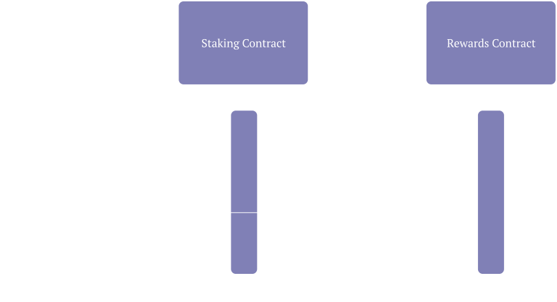
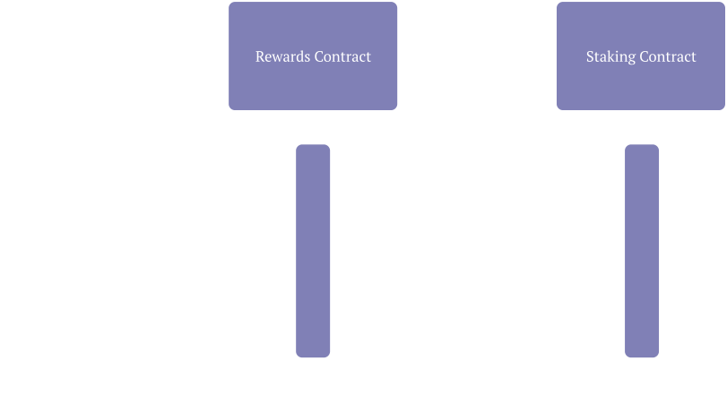
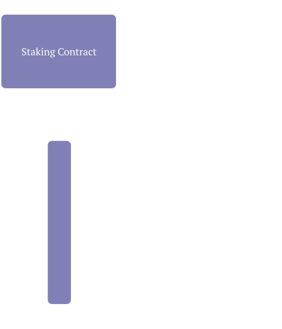
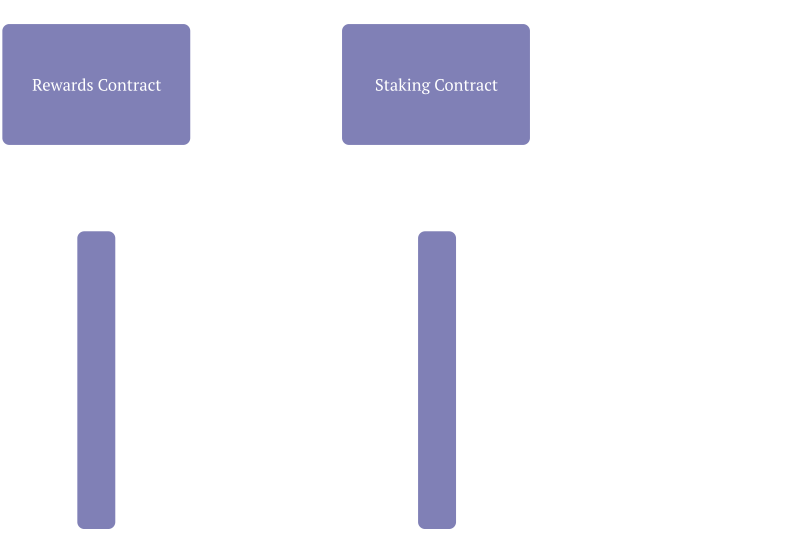
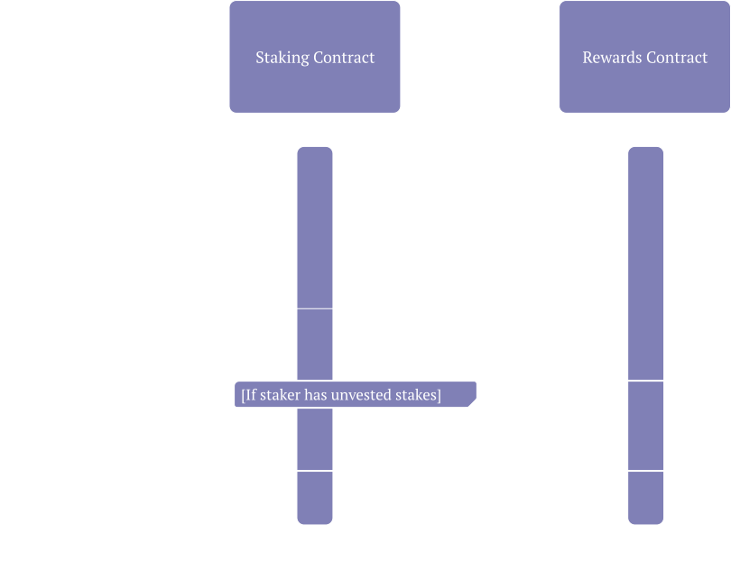
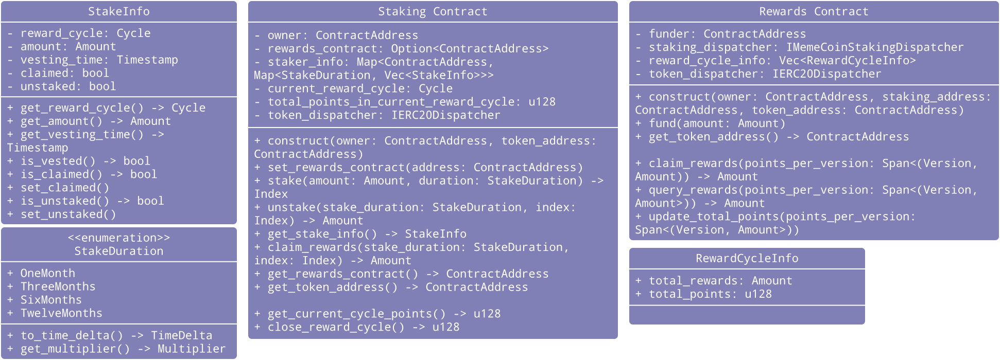

# Memecoin Staking 

## Overview
This repo provides a basic implementation for allowing the staking of any token on STARKNET. (though it's intended for use with memecoins specifically)

## Disclaimer
This codebase is an experimental PoC as part of Memecoin explorations at StarkWare, and has not undergone a professional audit.

## Functionality
The following functionality is provided by this implementation:
- Staking.
- Fetching information about current stakes.
    - Amount locked, vesting time, etc...
- Funding rewards for the stakers (by the contract owner).
- Claiming rewards for vested stakes.
- Unstaking.

## Deployment
Simply declare and deploy the `MemeCoinStaking` Contract, followed by the `MemeCoinRewards` Contract, invoke the `set_rewards_contract` method of the `MemeCoinStaking` Contract with the address of the `MemeCoinRewards` Contract, and you're all set!

## Flows
### Administrative Flows
#### Construct

#### Fund

### Staker Flows
#### Stake

#### Claim Rewards

#### Unstake

## Class Diagram

## Terminology
| Term | Explanation |
--- | ---
Stake | The act of locking an arbitrary amount of tokens for a set amount of time, expecting rewards given the tokens remain locked for the promised time frame. Longer time locks yield larger rewards.
Staker | One who Stakes.
Owner | The person responsible for the initial setup (specifically setting the Rewards Contract for the Staking Contract).
Funder | The person responsible for periodically funding the Rewards Contract.
Rewards | The prize tokens promised by the owner to the stakers in exchange for staking.
Staking Contract | The Smart Contract with which stakers interact, in charge of keeping track of stakes and distributing rewards back to the stakers.
Rewards Contract | The Smart Contract responsible for managing reward cycles, and transferring rewards to the Staking Contract for distribution.
Vesting | If a Stake remains staked for the promised time frame, it becomes vested, meaning it's rewards can now be claimed.
Unstaking | Requesting the Stake be transferred back to it's staker. This can be done both before and after the stake is vested. Note that unstaking early means forfeiting the potential rewards from the stake.
Points | An internal currency, assoiciated with each stake, which takes into account the amount staked and the length of time locked. Used to calculate Rewards when claiming them.
Reward Cycle | Whenever the Owner funds the Rewards Contract, a reward cycle is closed, setting the exchange rate between points and rewards for that cycle.
