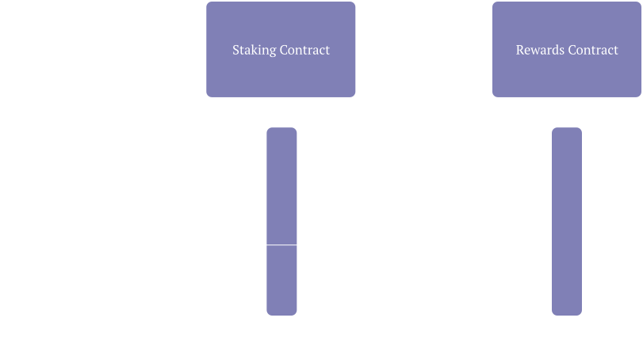
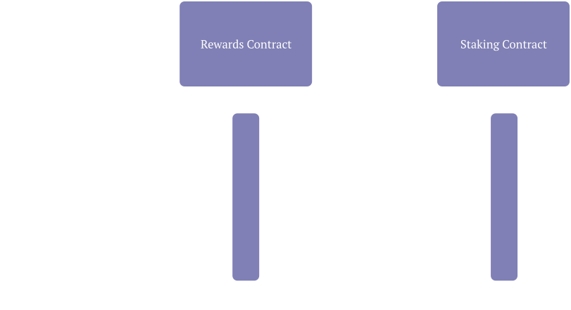
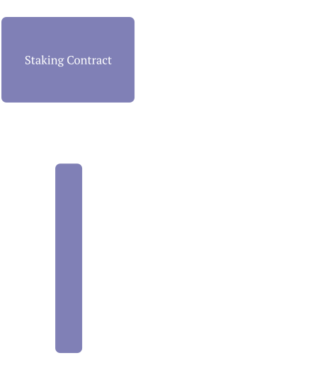
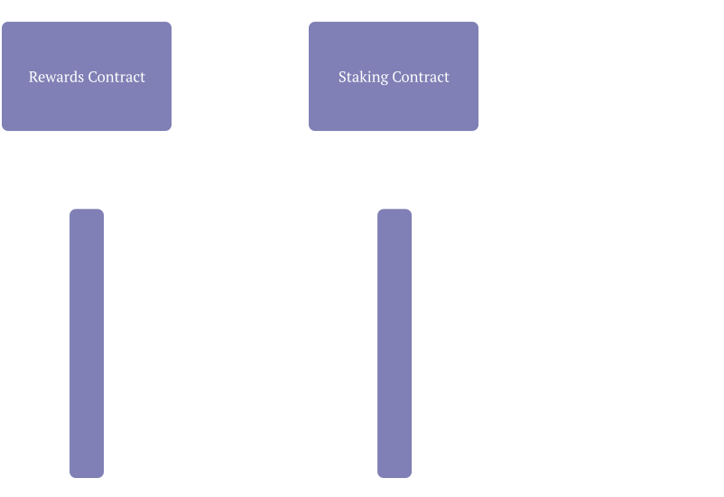
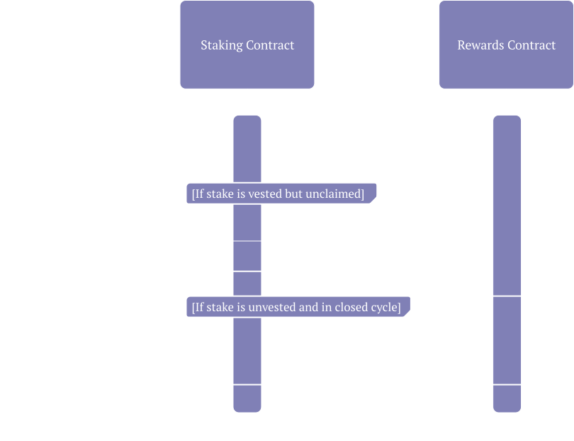
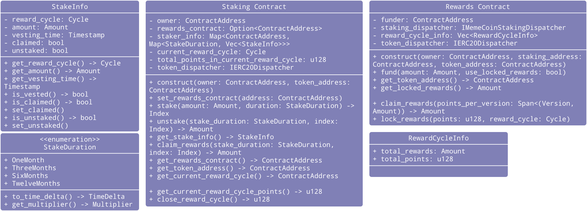

# Memecoin Staking


## Table of Contents
- [Overview](#overview)
- [Disclaimer](#disclaimer)
- [Features](#features)
- [Technical Details](#technical-details)
- [Deployment](#deployment)
- [API Reference](#api-reference)
- [Funder Instructions](#funder-instructions)
- [Usage Examples](#usage-examples)
- [Architecture](#architecture)
- [Terminology](#terminology)

## Overview
This repo provides a basic implementation for allowing the staking of any token on STARKNET. (though it's intended for use with memecoins specifically)

## Disclaimer
This codebase is an experimental PoC as part of Memecoin explorations at StarkWare, and has not undergone a professional audit.

## Features
The following functionality is provided by this implementation:
- Staking.
- Fetching information about current stakes.
    - Amount locked, vesting time, etc...
- Funding rewards for the stakers (by the contract owner).
- Claiming rewards for vested stakes.
- Unstaking.

## Technical Details
- **Supported Stake Durations**: 1, 3, 6, and 12 months
- **Reward Multipliers**:
  - 1 month: 1.0x
  - 3 months: 1.2x
  - 6 months: 1.5x
  - 12 months: 2.0x
- **Points System**: Rewards calculated as `amount × duration_multiplier`
- **Reward Cycles**: Closed manually by contract owner when funding

## Deployment
Simply declare and deploy the `MemeCoinStaking` Contract, followed by the `MemeCoinRewards` Contract, invoke the `set_rewards_contract` method of the `MemeCoinStaking` Contract with the address of the `MemeCoinRewards` Contract, and you're all set!

## API Reference

### MemeCoinStaking Contract
- `stake(amount, duration)` - Stake tokens for specified duration, returns stake index
- `unstake(duration, stake_index)` - Unstake tokens (claims rewards if vested)
- `claim_rewards(duration, stake_index)` - Claim rewards for vested stakes
- `get_stake_info(address, duration, index)` - View stake details
- `get_token_address()` - Get the staking token address
- `get_rewards_contract()` - Get the rewards contract address

### MemeCoinRewards Contract
- `fund(amount, use_locked_rewards)` - Fund reward cycles (funder only)
- `get_locked_rewards()` - View current locked rewards amount
- `get_token_address()` - Get the reward token address

### Stake Durations
- `OneMonth` - 30 days, 1.0x multiplier
- `ThreeMonths` - 90 days, 1.2x multiplier
- `SixMonths` - 180 days, 1.5x multiplier
- `TwelveMonths` - 360 days, 2.0x multiplier

## Funder Instructions

### Funding Process
You can fund reward cycles in two ways:

#### 1. External Token Funding
1. **Initial Setup**: Ensure you have sufficient reward tokens approved for the MemeCoinRewards contract
2. **Fund with External Tokens**: Call `fund(amount, false)` on the MemeCoinRewards contract
   - This closes the current reward cycle and starts a new one
   - Sets the points-to-rewards ratio for the previous cycle
   - Transfers `amount` tokens from your account to the rewards contract
   - Can only be called if there are active stakes in the current cycle

#### 2. Using Locked Rewards
1. **Fund with Locked Rewards**: Call `fund(0, true)` on the MemeCoinRewards contract
   - **Important**: When using locked rewards, the `amount` parameter MUST be 0
   - Uses all accumulated locked rewards as the funding for the new cycle
   - Resets the locked rewards counter to 0
   - No external token transfer occurs
   - Can only be called if there are active stakes in the current cycle

### Understanding Locked Rewards
When stakers unstake early (before vesting), their allocated rewards become "locked" rather than being lost. These locked rewards can be used as an alternative funding source:

#### How Locked Rewards Work
- **Source**: Generated when stakers unstake before their vesting period
- **Accumulation**: Locked rewards build up over time with each early unstaking
- **Usage**: Can be used INSTEAD of external funding (not in addition to)
- **Checking**: Call `get_locked_rewards()` to see the current amount available

#### Key Constraints
- **Exclusive Usage**: You can use either external tokens OR locked rewards, never both in the same transaction
- **Zero Amount Rule**: When using locked rewards, the amount parameter must be exactly 0
- **All or Nothing**: Using locked rewards consumes ALL available locked rewards for that cycle

#### Strategic Considerations
1. **Monitor locked rewards regularly** using `get_locked_rewards()`
2. **Choose funding method based on availability**:
   - Use locked rewards when available to save on external token costs
   - Use external funding when locked rewards are insufficient or unavailable
3. **Plan funding cycles** considering both funding sources

#### Example Funding Workflows

**Option A: Using External Tokens**
```bash
# 1. Check if locked rewards are available (optional)
starkli call <rewards_contract_address> get_locked_rewards

# 2. Approve reward tokens for transfer
starkli invoke <token_address> approve <rewards_contract_address> <amount>

# 3. Fund with external tokens
starkli invoke <rewards_contract_address> fund <amount> false
```

**Option B: Using Locked Rewards**
```bash
# 1. Check available locked rewards
starkli call <rewards_contract_address> get_locked_rewards

# 2. Fund using locked rewards (amount MUST be 0)
starkli invoke <rewards_contract_address> fund 0 true
```

### Best Practices for Funders
- **Regular Monitoring**: Always check locked rewards before each funding cycle to choose the optimal funding method
- **Strategic Funding**: Use locked rewards when available to minimize external token costs
- **Predictable Funding**: Maintain consistent funding schedules regardless of funding method to encourage long-term staking
- **Parameter Validation**: Always use `amount=0` when `use_locked_rewards=true` to avoid transaction failures
- **Balance Awareness**: Understand that locked rewards represent "recycled" rewards from early unstaking
- **Communication**: Consider informing stakers about funding schedules and encourage full vesting to maximize rewards

## Usage Examples

### For Stakers

**Staking tokens for 3 months**:
```bash
# Approve tokens for staking
starkli invoke <token_address> approve <staking_contract_address> <amount>

# Stake tokens
starkli invoke <staking_contract_address> stake <amount> ThreeMonths
```

**Checking stake information**:
```bash
starkli call <staking_contract_address> get_stake_info <your_address> ThreeMonths <stake_index>
```

**Claiming rewards (after vesting)**:
```bash
starkli invoke <staking_contract_address> claim_rewards ThreeMonths <stake_index>
```

**Unstaking (can be done anytime)**:
```bash
starkli invoke <staking_contract_address> unstake ThreeMonths <stake_index>
```

### For Contract Owners

**Setting up the rewards contract**:
```bash
starkli invoke <staking_contract_address> set_rewards_contract <rewards_contract_address>
```

## Architecture
### Administrative Flows
#### Construct

#### Fund


### Staker Flows
#### Stake

#### Claim Rewards

#### Unstake


## Class Diagram


## Terminology
| Term | Explanation |
--- | ---
Stake | The act of locking an arbitrary amount of tokens for a set amount of time, expecting rewards given the tokens remain locked for the promised time frame. Longer time locks yield larger rewards.
Staker | One who Stakes.
Owner | The person responsible for the initial setup (specifically setting the Rewards Contract for the Staking Contract).
Funder | The person responsible for periodically funding the Rewards Contract.
Rewards | The prize tokens promised by the owner to the stakers in exchange for staking.
Staking Contract | The Smart Contract with which stakers interact, in charge of keeping track of stakes and distributing rewards back to the stakers.
Rewards Contract | The Smart Contract responsible for managing reward cycles, and transferring rewards to the Staking Contract for distribution.
Vesting | If a Stake remains staked for the promised time frame, it becomes vested, meaning it's rewards can now be claimed.
Unstaking | Requesting the Stake be transferred back to it's staker. This can be done both before and after the stake is vested. Note that unstaking early means forfeiting the potential rewards from the stake.
Points | An internal currency, associated with each stake, which takes into account the amount staked and the length of time locked. Used to calculate Rewards when claiming them.
Locked Rewards | Rewards that were allocated to stakes but become "locked" when stakers unstake early (before vesting). These rewards accumulate in the Rewards Contract and can be used by the Funder as an alternative funding source instead of external tokens.
Reward Cycle | Whenever the Funder funds the Rewards Contract (either with external tokens or locked rewards), a reward cycle is closed, setting the exchange rate between points and rewards for that cycle.
