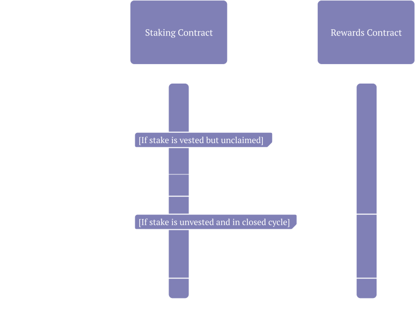

# Memecoin Staking 

## Overview
This repo provides a basic implementation for allowing the staking of any token on STARKNET.

## Disclaimer
This codebase is an experimental PoC as part of Memecoin explorations at StarkWare, and has not undergone a professional audit.

## Flows
### Owner Flows
#### Construct

#### Fund

### Staker Flows
#### Stake

#### Unstake

#### Query Rewards

#### Claim Rewards

